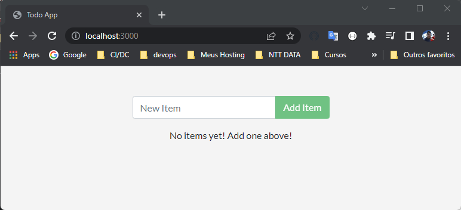
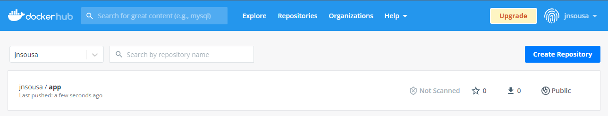
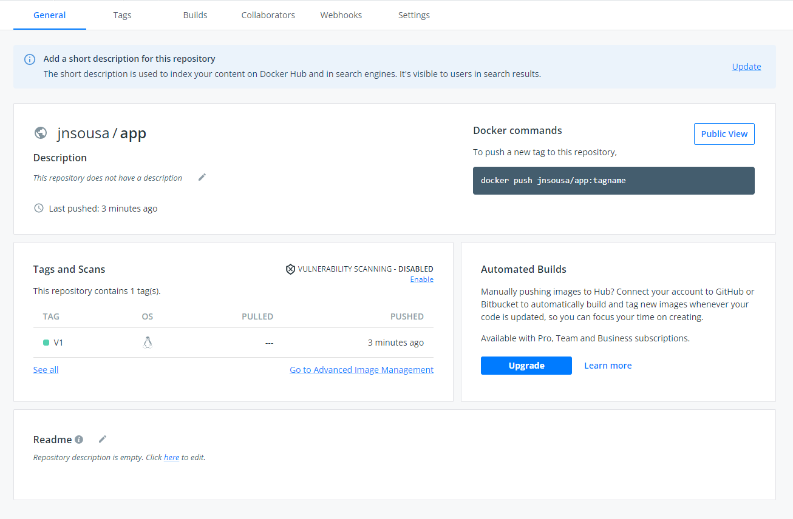

# Comando Docker executados aplicação

## Escolhendo a imagem

* Escolher a imagem a ser executada a aplicação 'node:12-alpine'
* Criar o arquivo 'Dockerfile'

### Criando imagem

```
> docker build -t app .
```

### Verificar se foi criado a imagem
```
> docker images
REPOSITORY                   TAG         IMAGE ID       CREATED         SIZE
app                          latest      f3c43579a64e   4 months ago    91MB
```

### Criar Container com a imagem

### No modo interativo e com shell

```
> docker run -it app sh
/ #
```

```
/ # ls
bin    dev    etc    home   lib    media  mnt    opt    proc   root   run    sbin   srv    sys    tmp    usr    var
/ #
```
### Verificar se tem node instalado

```
/ # node --version
v12.22.12
/ #
```
### Sair

```
/ # exit
PS F:\workspace-cursos\docker\Docker_2022\aplicacao\app>
```

## Copiando arquivos na Imagem

* Editar o arquivo Docker file

```
FROM node:12-alpine

WORKDIR /app

COPY . .
``` 

### Montar novamente a imagem

```
> docker build -t app .
/ #
```

### Criar novamente o container no modo interativo e com shell

```
> docker run -it app sh
/app #
```

```
/app # ls
Dockerfile    README.md     package.json  spec          src           yarn.lock
/app #
```

## Utilizando o RUN

* Serve para instalar as dependências da aplicação

### Verificar se Python esta instalado

```
/app # python --version
sh: python: not found
/app #
```
* Não esta instalado

### Editar o arquivo Docker file

```
FROM node:12-alpine

WORKDIR /app

COPY . .

RUN apk add --no-cache python2 g++ make
``` 

### Montar novamente a imagem

```
> docker build -t app .
/ #
```

### Criar novamente o container no modo interativo e com shell

```
> docker run -it app sh
/app #
```

### Verificar novamente se Python esta instalado

```
/app # python --version
Python 2.7.18
/app #
```

* OK instalado

## Configurando Variáveis

## Comando ENV

* É utilizado quando a sua api tem dependencia com outras api como banco dados, URL etc...

Exemplo:

```
ENV API_URL=http://api.outraapi.com
```
Nesse caso api que estamos utilizando não precisa desse recurso.

## Utilizando o EXPOSE

* Utilizado para mapear as porta dos containers com as máquinas root. 

### Atualizando arquivo Dockerfile
```
FROM node:12-alpine

WORKDIR /app

COPY . .

RUN apk add --no-cache python2 g++ make

EXPOSE 3000
```

## Utilizando o CMD

* Utilizado para executar comando dentro do container no momento for criado

* Diferença do RUN para CMD
  * RUN é executado quando esta criando a imagem
  * CMD é executado depois que foi criado a imagem

### Atualizando arquivo Dockerfile
```
FROM node:12-alpine

WORKDIR /app

COPY . .

RUN apk add --no-cache python2 g++ make

RUN yarn install --production

CMD [ "node", "src/index.js" ]

EXPOSE 3000
```

## Adicionando um usuário na imagem

### Comando USER

* Todo linux já possui o usuário root.
* Não é boa pratica executar aplicação com usuario root pois ele possui todas as permissões.

### Atualizando arquivo Dockerfile
```
FROM node:12-alpine

WORKDIR /app

RUN addgroup dev && adduser -S -G jairo dev

USER jairo

COPY . .

RUN apk add --no-cache python2 g++ make

RUN yarn install --production

CMD [ "node", "src/index.js" ]

EXPOSE 3000
```

* Não vamos criar usuarios nessa aplicação.

## Rodando a sua aplicação

### Construir novamente a imagem
```
> docker build -t app .
```

### Rodar aplicação mapeando para porta 3000

```
 > docker run -dp 3000:3000 app
 > 032310a49edb9b9760ad4827f9e6f3fc50bd0c25ac2d8b78191ad444dc868ce8
```
-dp -> rodar em background e maper a portas


### Verificar no browse se aplicação esta funcionado

http://localhost:3000/



## Melhorando a performance

* Toda vez que o docker cri uma imagem ele consegue armazenas essas informações no cache.

### Atualizar o dockerfile

```
FROM node:12-alpine

WORKDIR /app

COPY package.json .

RUN apk add --no-cache python2 g++ make

RUN yarn install --production

COPY . .

CMD [ "node", "src/index.js" ]

EXPOSE 3000
```
 Refaça o processo de criação de imagem e rode o container novamente.

 ## Adicionando tags a imagens

 ```
  docker images
REPOSITORY                   TAG         IMAGE ID       CREATED         SIZE
app                          latest      2183c68204e7   5 hours ago     399MB
```

* Verificar a tag atual é latest (mais recente) o ruim nessa situação nem sempre é a ataual, sempre bom versionar as images.
* Se não informar uma tag o docker se encarrega de colocar o latest.

### Renomerar imagem atual

```
> docker image tag app:latest app:v1.0.0
```
```
2> docker images
REPOSITORY                   TAG         IMAGE ID       CREATED         SIZE
app                          latest      2183c68204e7   5 hours ago     399MB
app                          v1.0.0      2183c68204e7   5 hours ago     399MB
```
* Repare aparece as duas imagem mais ela são identicas e tem o mesmo ID.

## Compartilhando imagens

### Upload da maquina para Dcker Hub

* É preciso adicionar tag igual á do ropositorio:
```
jnsousa/app
```

* Pode renomear image existente ou gerar nova com a tag

      * Criar
```
> docker build -t jnsousa/app:V1
```

```
 docker images
REPOSITORY                   TAG         IMAGE ID       CREATED         SIZE
jnsousa/app                  V1          9ddae7737e8a   9 seconds ago   399MB
app                          latest      2183c68204e7   5 hours ago     399MB
app                          v1.0.0      2183c68204e7   5 hours ago     399MB
```

### Docker login

```
> docker login
Authenticating with existing credentials...
Login Succeeded

Logging in with your password grants your terminal complete access to your account.
For better security, log in with a limited-privilege personal access token. Learn more at https://docs.docker.com/go/access-tokens/
```

### Upload

```
> docker push jnsousa/app:V1
The push refers to repository [docker.io/jnsousa/app]
219be724e75e: Pushed
d040ff2a2cec: Pushed
e3cf86c67120: Pushed
02e4e117dfdd: Pushed
4c59d2840fdf: Pushed
7f30cde3f699: Mounted from library/node
fe810f5902cc: Mounted from library/node
dfd8c046c602: Mounted from library/node
4fc242d58285: Mounted from library/node
V1: digest: sha256:c314b589692748d9500c14c8eb78bb7baa18ad41c704652d041a11455c4e81ec size: 2207
```

### Verificar no Docker Hub




## Salvando e carregando imagens

### Salvando
```
> docker image save -o appV1.zip app:v1.0.0
```

* No diretorio aplicação deverá ser criado arquivo appv1.zip

### Remover

* Antes para garantir remova a imagem original

```
> docker image rm app:v1.0.0
```

### Load (Carregar)

```
>  docker images
REPOSITORY                   TAG         IMAGE ID       CREATED          SIZE
jnsousa/app                  V1          9ddae7737e8a   21 minutes ago   399MB
```
* Repare não existe mais a imagem app:v1.0.0

```
> docker image load -i appv1.zip
Loaded image: app:v1.0.0
```

```
> docker images
REPOSITORY                   TAG         IMAGE ID       CREATED          SIZE
jnsousa/app                  V1          9ddae7737e8a   25 minutes ago   399MB
app                          v1.0.0      2183c68204e7   5 hours ago      399MB
```

